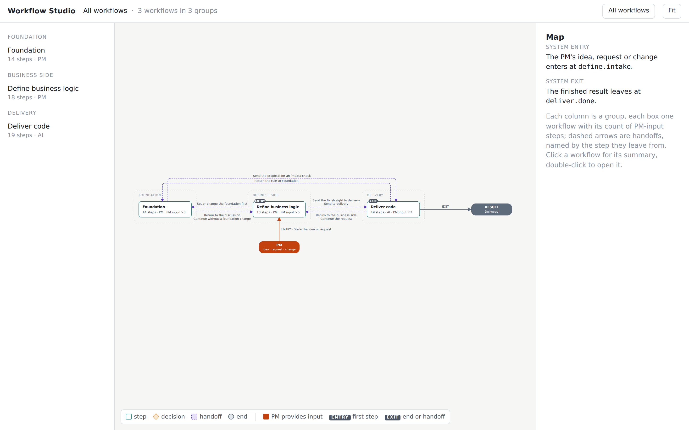
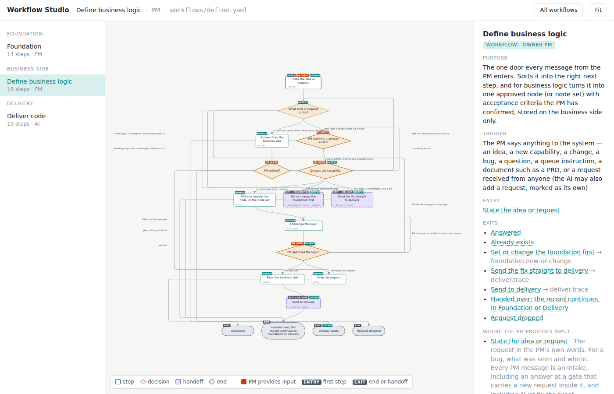
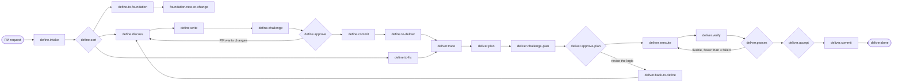

# Workflow Studio

*A product-development framework in which one PM and one AI ship a product through three PM gates that a tool enforces, not advises.*

**The PM says what the product should do; the AI sorts, drafts, challenges its draft, plans, builds and verifies; `orchestrate.py` refuses to move a change past a gate without that gate's artifact.**

   

**Status:** working, unreleased; on 2026-09-11 `python3 tools/check_all.py` printed `ALL CHECKS PASSED`.



`workflows/*.yaml` hold the workflows, `framework/tools/orchestrate.py` enforces them, [studio.html](studio.html) draws them; a product repository copies `framework/` in and runs the first command below.

```bash
cp -r ~/Downloads/workflow-studio/framework . && cp -r ~/Downloads/workflow-studio/workflows framework/
python3 framework/tools/orchestrate.py check
```

```
CLOSED — 51 steps, every one mapped to a role and mode; 21 commands, every one entering a real non-routing step; 1 meta command entering the record's current step; toolbox: 3 step row(s)
```

> An AI agent operating this framework in a product repository reads [For AI agents](#for-ai-agents), then that repository's `AGENTS.md` and `framework/README.md`.

## Table of contents

- [Key features](#key-features)
- [The three workflows](#the-three-workflows)
- [Main path of a request](#main-path-of-a-request)
- [Installation](#installation)
- [Quickstart](#quickstart)
- [Worked example: a refund within 7 days](#worked-example-a-refund-within-7-days)
- [Reference tables](#reference-tables)
- [How it works](#how-it-works)
- [Tests and evaluation](#tests-and-evaluation)
- [Troubleshooting](#troubleshooting)
- [For AI agents](#for-ai-agents)
- [Customizing the workflows](#customizing-the-workflows)
- [Limits and non-goals](#limits-and-non-goals)
- [Further documentation](#further-documentation)
- [Support and contributing](#support-and-contributing)
- [Acknowledgements](#acknowledgements)
- [License](#license)

## Key features

- **A tool enforces the gates.** `orchestrate.py advance` is the only way a record moves; the [worked example](#worked-example-a-refund-within-7-days) shows six refusals.
- **The PM never reads code.** The node, the record, the plan section and the acceptance evidence are plain language.
- **Every draft is challenged first.** The architecture file, the node, the plan and the code each get a second AI pass in a fresh context ([challenger-pass.md](framework/components/challenger-pass.md)); zero findings are refused while a framing is unused.
- **State lives in one file per request.** The record's front matter holds the step, the lane and every edge taken; any AI resumes with `orchestrate.py next`.
- **Decisions are brought forward.** A gate answer with an alternative becomes a file under `decisions/` ([decision-log.md](framework/components/decision-log.md)), shown to the PM before a draft alters it.
- **Commands carry the vocabulary of [GitHub Spec Kit](https://github.com/github/spec-kit).** `/speckit-specify`, `/speckit-plan` and `/speckit-implement` land in the folders Spec Kit uses, so a move either way is a file swap.

## The three workflows

| Workflow | Owner | Question it answers | Steps | What the PM receives |
|---|---|---|---|---|
| `define` | PM | What should the product do? | 18 | One approved node (description and acceptance criteria) on the business side |
| `foundation` | PM | What may the AI build with? | 14 | The architecture file, the glossary, or one changed rule |
| `deliver` | AI | Is it built and does it work? | 19 | Tagged, tested components, one commit, the record closed |



## Main path of a request

Every request enters at `define.intake`; the PM gates are `define.approve`, `deliver.approve-plan` and `deliver.accept`.



## Installation

No package: a product repository holds a copy of `framework/`. Requirements:

| Requirement | Why |
|---|---|
| Python 3.9 or newer | `tools/check_all.py` passed on 3.9.6 (macOS system Python) on 2026-09-11; annotations are deferred in every tool |
| [PyYAML](https://pypi.org/project/PyYAML/) | every tool imports `yaml` and nothing declares it |
| git | `commit.py` refuses to run outside a git repository |
| one of the five AI tools in the table below | runs the slash commands |
| `gh` (optional) | serves only `/speckit-taskstoissues` |

### Linux and macOS

```bash
pip install pyyaml
mkdir my-product && cd my-product && git init
cp -r ~/Downloads/workflow-studio/framework .
cp -r ~/Downloads/workflow-studio/workflows framework/
cp framework/templates/AGENTS.md framework/templates/CLAUDE.md .
python3 framework/tools/orchestrate.py check
```

```
CLOSED — 51 steps, every one mapped to a role and mode; 21 commands, every one entering a real non-routing step; 1 meta command entering the record's current step; toolbox: 3 step row(s)
```

### Slash commands for one AI tool

`install_commands.py` writes the 22 templates from [framework/commands/](framework/commands/) into the tool's folder.

```bash
python3 framework/tools/install_commands.py --agent claude
```

```
claude: .claude/skills/
installed 22 file(s); invoke as /speckit-<name> (Gemini: /speckit.<name>)
```

| Tool | Install flag | Commands land in | Invoke as |
|---|---|---|---|
| Claude Code | `--agent claude` | `.claude/skills/speckit-<name>/SKILL.md` | `/speckit-<name>` |
| Codex | `--agent codex` | `.agents/skills/speckit-<name>/SKILL.md` | `/speckit-<name>` |
| GitHub Copilot | `--agent copilot` | `.github/skills/speckit-<name>/SKILL.md` | `/speckit-<name>` |
| Gemini CLI | `--agent gemini` | `.gemini/commands/speckit.<name>.toml` | `/speckit.<name>` |
| Cursor | `--agent cursor` | `.cursor/skills/speckit-<name>/SKILL.md` | `/speckit-<name>` |

`--agent all` installs all five layouts, 110 files. The PM fills in the two commands left open in `AGENTS.md`: run the product, run the tests.

## Quickstart

1. Install the framework and one tool's commands ([Installation](#installation)).
2. Describe the architecture with `/speckit-constitution Node 20 + Fastify backend under code/backend, Postgres on Supabase. Run with npm run dev. Never touch migrations/ by hand.`; then write the glossary.
3. State a request with `/speckit-specify Members can cancel a policy within 7 days of purchase and get the full premium back, as long as no claim was filed.`; the AI stops at `define.approve` with the challenged draft.
4. Approve the logic with `/speckit-approve yes`; the node is saved under `logic/`.
5. Run `/speckit-plan`; the AI stops at `deliver.approve-plan`: `execute`, `revise the plan`, `revise the logic` or `drop`.
6. Try the product and answer `/speckit-accept accepted`.
7. Run `/speckit-git-commit` for the one commit that carries code, tests and the record.

### One command per request

Steps 3 to 7 collapse into one command the PM repeats after each answer: the runner spawns a fresh harness process per AI step and stops where the PM is needed. This 2026-09-11 run used the test harness; `--harness claude` spawns `claude -p`.

```bash
python3 framework/tools/run.py changes/2026-09-11-1-cancel-policy.md --harness fake
```

```
PM step: define.discuss — Discuss the capability
The PM must provide: What the product must do, for whom, where it sits in the tree, what must be true to call it working; for a cross-cutting change, which nodes it touches. Or a correction of the sorting: it is a fix, it already exists, it needs the foundation, or stop.
Options (the exits the YAML allows):
  1. define.write   when: it is business logic; write it
  2. define.to-fix   when: the logic is unchanged; it is a fix
  3. define.confirm-exists   when: it already exists
  4. define.to-foundation   when: it needs the foundation first
  5. define.drop   when: PM stops the request
run: 1 step(s) run, 1 PM stop(s), 0.4s total (define.sort 0.1s); stopped at PM step define.discuss
```

The full output spells out the next `advance --answer` command. Exit 3 is a PM stop, 0 a closed record, 4 a stuck step (or a harness that moved the record in a way the contract forbids, such as answering a PM gate itself); logs land in `changes/runs/<record>/`.

## Worked example: a refund within 7 days

The slash commands run these for the AI; they ran on 2026-09-10 in a fresh product folder, every output block verbatim. Four more requests reach the same machinery:

| Request | Command to paste |
|---|---|
| A bug against delivered logic | `/speckit-bug-assess The refund goes to the new card, not the original one` |
| A change to one architecture rule | `/speckit-rule Move the backend from Fastify to Hono` |
| A question answered from the decision log | `/speckit-why Why is the refund window 7 days and not 14?` |
| The state of every request | `/speckit-status` |

### define.intake records the PM's words

```bash
python3 framework/tools/orchestrate.py start changes/2026-09-10-1-refund-unused-policy.md --command speckit.specify
```

```
started at define.intake via speckit.specify
step:     define.intake — State the idea or request
mode:     pm   role: Sorter   lane: full   waiting on: PM since 2026-09-10T11:17+00:00
inputs:   request
PM gives: The request in the PM's own words. For a bug, what was seen and where. Every PM message is an intake, including an answer at a gate that carries a new request inside it, and including "just fix the typo".  → record it with `advance --answer`
does:     PM states what is wanted: a new capability, a change to existing logic, a bug against delivered logic, a dependency patch or a refactor that keeps behaviour, a question about the product or its status, a queue instruction (cancel, reorder), a document (a PRD, notes) holding several of these, or a request received from someone else. A document is split by the AI into one record per request, listed back to the PM to order.
produces: A change record is created for the request the moment it is stated (named by date, number and a short slug), with a status line naming the current step, who it waits on, and since when; the queue lists all records in order.
exits:
  1. → define.sort
```

Leaving the PM step without an answer is refused.

```bash
python3 framework/tools/orchestrate.py advance changes/2026-09-10-1-refund-unused-policy.md --to sort
```

```
refused: define.intake is a PM step; record the PM's answer with --answer "…"
```

```bash
python3 framework/tools/orchestrate.py advance changes/2026-09-10-1-refund-unused-policy.md --to sort --answer "Members can cancel a policy within 7 days of purchase and get the full premium back, as long as no claim was filed"
```

```
define.intake → define.sort
step:     define.sort — What kind of request is this?
mode:     agent   role: Sorter   lane: full   waiting on: AI since 2026-09-10T11:17+00:00
inputs:   record, architecture, logic-index, queue, decisions-index
does:     The AI reads the architecture file and searches the logic tree and the queue, then sorts the request and writes why. The PM overrules the sorting at the first PM step of the chosen path: settled (a question), confirm-exists, discuss (which can redirect to any other path), the Foundation input step (which can say "not needed"), or deliver.approve-plan.
produces: The kind chosen, the reason, and the lane (small or full), written into the record's state
exits:
  1. → define.answer   when: a question (what does the product do, where is a request, why does it behave this way, is this in scope, show me the product) or a queue instruction (cancel or reorder a waiting request)
  2. → define.confirm-exists   when: the logic already exists as a node
  3. → define.discuss   when: new logic, a change to an existing node, or a cross-cutting change to several nodes
  4. → define.to-foundation   when: no architecture file yet, or the request needs a tool, language or rule the architecture does not allow
  5. → define.to-fix   when: existing logic and unchanged criteria — code wrong (the AI can name the violated criterion), a dependency patch, or a refactor that keeps behaviour
last edges:
  define.intake → define.sort  answer: Members can cancel a policy within 7 days of purchase and get the full premium back, as long as no claim was filed
```

### define.challenge refuses to be skipped or empty

After exit 3 of `define.sort` and the PM's notes at `discuss`, the draft reached `define.challenge`.

```bash
python3 framework/tools/orchestrate.py advance changes/2026-09-10-1-refund-unused-policy.md --to approve
```

```
refused: write the block `## Findings — define.challenge` into the record before leaving (a line "none" if nothing was found)
```

With the block written as `none`, the same command is refused again and `rerun` names the next framing.

```bash
python3 framework/tools/orchestrate.py advance changes/2026-09-10-1-refund-unused-policy.md --to approve
```

```
refused: zero findings on the full lane with framings left; run `rerun` and challenge again
```

```bash
python3 framework/tools/orchestrate.py rerun changes/2026-09-10-1-refund-unused-policy.md
```

```
rerun 1: framing → the owner of the neighbouring nodes
```

With one finding written, the record reached `define.approve`, the PM answered `yes`, and `define.commit` handed it to `deliver.trace`.

### deliver.trace refuses a jump to code or a commit

```bash
python3 framework/tools/orchestrate.py advance changes/2026-09-10-1-refund-unused-policy.md --to execute
```

```
refused: deliver.trace has no edge to execute. Legal exits: 1. deliver.plan
```

```bash
python3 framework/tools/commit.py changes/2026-09-10-1-refund-unused-policy.md --dry-run
```

```
refused: the record is at deliver.trace, not deliver.commit; the commit happens only after the PM accepts at deliver.accept
```

A fresh record is refused at `deliver.execute` too.

```bash
python3 framework/tools/orchestrate.py start changes/2026-09-10-2-fresh.md --command speckit.implement
```

```
refused: speckit.implement is not an entry command; it continues a record already at deliver.execute (this one is at no state). New requests start with speckit.specify.
```

### deliver.commit makes the one commit

The record passed `plan`, `challenge-plan`, `approve-plan` (`execute`), `execute`, `verify` and `passes`; the PM answered `accepted` at `deliver.accept`, and `commit.py` committed the delivery's files only.

```bash
python3 framework/tools/commit.py changes/2026-09-10-1-refund-unused-policy.md
```

```
logic_index.py: ok
components_index.py: ok
decisions_index.py: ok
deliver.commit → deliver.was-rule
deliver.was-rule → deliver.done  (when: no (a node or a fix was delivered), or the request was the rule itself)
committed 2792e4c: refund-unused-policy: 2026-09-10-1-refund-unused-policy
files: changes/2026-09-10-1-refund-unused-policy.md, code/COMPONENTS.md, code/backend/refunds, decisions/INDEX.md, logic/INDEX.md, logic/policy/refund-unused-policy.md
```

## Reference tables

Command names follow [GitHub Spec Kit](https://github.com/github/spec-kit) where the meaning overlaps; eight entry commands create a record at `define.intake`, every other command continues a record already at its step or is refused ([commands.yaml](framework/orchestration/commands.yaml)).

<details>
<summary>The 22 slash commands</summary>

| Command | Enters step | Purpose | Spec Kit equivalent |
|---|---|---|---|
| `/speckit-constitution` | `define.intake` | The PM states the architecture as the first request; it is sorted to Foundation | `speckit.constitution` |
| `/speckit-specify` | `define.intake` | The PM states any request; it is sorted and, for logic, discussed and drafted as a node | `speckit.specify` |
| `/speckit-clarify` | `define.write` | The AI asks the open questions on the draft: at most three, one at a time, each with a recommended option | `speckit.clarify` |
| `/speckit-checklist` | `define.challenge` | The challenger reviews the draft node and returns findings | `speckit.checklist` |
| `/speckit-approve` | `define.approve` | The PM approves the logic and confirms the criteria | none |
| `/speckit-plan` | `deliver.trace` | The AI traces the affected code and components, then writes the plan | `speckit.plan` |
| `/speckit-tasks` | `deliver.plan` | The AI rewrites the plan and its task list; `challenge-plan` runs again | `speckit.tasks` |
| `/speckit-analyze` | `deliver.challenge-plan` | The challenger reviews the plan with the criterion-to-task coverage table | `speckit.analyze` |
| `/speckit-implement` | `deliver.execute` | The AI continues a record whose plan was answered `execute`; any other record is refused | `speckit.implement` |
| `/speckit-converge` | `deliver.verify` | The AI verifies against the criteria and routes through `passes` | `speckit.converge` |
| `/speckit-accept` | `deliver.accept` | The PM uses the result or reads the evidence and answers | none |
| `/speckit-bug-assess` | `define.intake` | The PM reports a bug; it is sorted as a fix when the violated criterion can be named | `speckit.bug.assess` |
| `/speckit-bug-fix` | `deliver.execute` | The AI executes the approved fix plan | `speckit.bug.fix` |
| `/speckit-bug-test` | `deliver.verify` | The AI verifies the fix; it passes only if the failing criterion now holds | `speckit.bug.test` |
| `/speckit-assess-intake` | `define.intake` | The PM states an idea; it is sorted like any request | `speckit.assess.intake` |
| `/speckit-rule` | `define.intake` | The PM asks for a change to one architecture rule; the decision behind the current rule is brought forward | none |
| `/speckit-status` | `define.intake` | The PM asks where everything is; the answer comes from the queue | none |
| `/speckit-why` | `define.intake` | The PM asks why the product behaves this way; the answer comes from the decision log first | none |
| `/speckit-drop` | `define.intake` | The PM stops a request at the current gate or through a queue instruction | none |
| `/speckit-taskstoissues` | `deliver.execute` | The AI mirrors the task list as GitHub issues through `tasks_to_issues.py`; it moves nothing and is refused before the plan is approved | `speckit.taskstoissues` |
| `/speckit-git-commit` | `deliver.commit` | The AI makes the one code commit through `commit.py`; any record not at `deliver.commit` is refused | `speckit.git.commit` |
| `/speckit-run` | the record's current step (`meta`) | The runner `run.py` starts every AI step in a fresh harness process and stops at the next PM step | none |

</details>

The 51 steps below come from `workflows/*.yaml`; [framework/steps.md](framework/steps.md) carries every condition.

<details>
<summary>The 18 steps of define</summary>

| Step | Owner | Title | Labels |
|---|---|---|---|
| `intake` | PM | State the idea or request | ENTRY · PM INPUT · OUTPUT |
| `sort` | AI | What kind of request is this? | OUTPUT |
| `answer` | AI | Answer from the business side | OUTPUT |
| `settled` | PM | PM settled? | PM INPUT |
| `answered` | PM | Answered | EXIT |
| `confirm-exists` | PM | PM confirms it already exists? | PM INPUT |
| `exists` | PM | Already exists | EXIT · OUTPUT |
| `to-foundation` | PM | Set or change the foundation first | EXIT → `foundation.new-or-change` · OUTPUT |
| `to-fix` | PM | Send the fix straight to delivery | EXIT → `deliver.trace` · OUTPUT |
| `discuss` | PM | Discuss the capability | PM INPUT · OUTPUT |
| `write` | AI | Write or update the node, or the node set | OUTPUT |
| `challenge` | AI | Challenge the logic | OUTPUT |
| `approve` | PM | PM approves the logic? | PM INPUT · OUTPUT |
| `commit` | AI | Save the business side | OUTPUT |
| `to-deliver` | PM | Send to delivery | EXIT → `deliver.trace` · OUTPUT |
| `drop` | AI | Drop the request | OUTPUT |
| `handed-over` | PM | Handed over; the record continues in Foundation or Delivery | EXIT |
| `dropped` | PM | Request dropped | EXIT |

</details>

<details>
<summary>The 14 steps of foundation</summary>

| Step | Owner | Title | Labels |
|---|---|---|---|
| `new-or-change` | AI | New product or rule change? | ENTRY |
| `architecture` | PM | Write the architecture file | PM INPUT · OUTPUT |
| `check` | AI | Architecture file complete and consistent? | OUTPUT |
| `glossary` | PM | Write the glossary | PM INPUT |
| `save` | AI | Save the foundation | OUTPUT |
| `foundation-only` | AI | Was the request the foundation itself? | none |
| `ready` | PM | Return to the discussion | EXIT → `define.discuss` · OUTPUT |
| `propose-rule` | PM | Propose the changed rule | PM INPUT · OUTPUT |
| `check-rule` | AI | Proposed rule consistent with the file? | OUTPUT |
| `impact` | PM | Send the proposal for an impact check | EXIT → `deliver.trace` · OUTPUT |
| `not-needed` | PM | Continue without a foundation change | EXIT → `define.discuss` · OUTPUT |
| `drop` | AI | Drop the request | OUTPUT |
| `dropped` | PM | Request dropped | EXIT |
| `done` | PM | Foundation handled | EXIT |

</details>

<details>
<summary>The 19 steps of deliver</summary>

| Step | Owner | Title | Labels |
|---|---|---|---|
| `trace` | AI | Trace the affected code and reusable components | ENTRY · OUTPUT |
| `plan` | AI | Write the change plan in plain language | OUTPUT |
| `challenge-plan` | AI | Challenge the plan | OUTPUT |
| `approve-plan` | PM | PM approves the plan? | PM INPUT · OUTPUT |
| `execute` | AI | Execute the change | OUTPUT |
| `tasks-done` | AI | All tasks done as planned? | none |
| `verify` | AI | Verify against the acceptance criteria | OUTPUT |
| `passes` | AI | Verification passes? | OUTPUT |
| `accept` | PM | PM accepts the result? | PM INPUT · OUTPUT |
| `commit` | AI | Save code, tests and record together | OUTPUT |
| `was-rule` | AI | Was this a proposed rule? | none |
| `drop` | AI | Drop the change | OUTPUT |
| `was-rule-drop` | AI | Did a request need this rule? | none |
| `back-to-define` | AI | Return to the business side | EXIT → `define.discuss` · OUTPUT |
| `back-to-foundation` | AI | Return the rule to Foundation | EXIT → `foundation.propose-rule` · OUTPUT |
| `resume-define` | AI | Continue the request | EXIT → `define.discuss` · OUTPUT |
| `returned` | AI | Sent back for revision | EXIT |
| `dropped` | AI | Change dropped | EXIT |
| `done` | AI | Delivered | EXIT |

</details>

<details>
<summary>The tools and their refusals</summary>

| Tool | Run from | Purpose | Refuses |
|---|---|---|---|
| `framework/tools/orchestrate.py` | product repository | runs `check`, `start`, `next`, `advance` and `rerun` on a change record | an edge not in the YAML, a PM step without `--answer`, a challenger step without its findings block, a fourth `execute` after three failed passes |
| `framework/tools/install_commands.py` | product repository | writes the 21 command templates for one tool or all five | an unknown `--agent` |
| `framework/tools/tasks_to_issues.py` | product repository | creates one GitHub issue per task line and writes the number back; `--dry-run` is the default without `gh` | a record before `deliver.execute` |
| `framework/tools/commit.py` | product repository | makes the one code commit: regenerates the indexes, sets the node status and moves the record to `deliver.done` | a record not at `deliver.commit`, a git index with unrelated staged changes, a decision log that fails validation |
| `framework/tools/logic_index.py`, `components_index.py`, `decisions_index.py` | product repository | generate `logic/INDEX.md`, `code/COMPONENTS.md`, `decisions/INDEX.md` | a decision file with a missing field, a wrong category or a broken supersede chain (exit 1) |
| `tools/validate.py` | this repository | checks `workflows/*.yaml` and `map.yaml` against the 8 graph rules in [SCHEMA.md](SCHEMA.md#graph-rules-validator-enforced) | a duplicate key, a blank field, a stale step, two exits with one condition |
| `tools/build.py` | this repository | embeds the YAML into `studio.html` and `build/studio.artifact.html`, then runs `docs.py` | a failing validation |
| `tools/docs.py` | this repository | generates `framework/steps.md` | a failing validation |
| `tools/check_all.py` | this repository | runs every check above in order and stops at the first failure | the first failure |

</details>

## How it works

- **The YAML is the state machine.** [map.yaml](map.yaml) names the entry `define.intake` and the exit `deliver.done`; [SCHEMA.md](SCHEMA.md) defines the step types `step`, `decision`, `handoff` and `end`.
- **The change record is the state.** Its front matter carries `step`, `lane`, `waiting_on`, `failed_passes`, `rerun_count` and `history`.
- **Each step has one role and one mode.** [roles.yaml](framework/orchestration/roles.yaml) maps the 51 steps to six roles and four modes; a role is a fresh context reading only its inputs.
- **Each term the PM reads has one definition file.** The 12 files under [framework/components/](framework/components/) share five sections.
- **The renderer works offline.** `studio.html` embeds the workflows.

<details>
<summary>File layout of a product repository</summary>

```
architecture.md            the architecture file, written by the PM
glossary.md                the glossary, written by the PM
logic/                     the logic tree, one file per node; logic/INDEX.md is generated
decisions/                 D-0001-sessions.md and so on, one per decision that had an alternative; INDEX.md is generated
changes/                   one change record per request; changes/QUEUE.md is the index
code/backend/refunds/      one component per folder with its tests, tagged @node refund-unused-policy; code/COMPONENTS.md is generated
framework/                 copied from this repository, with framework/workflows/ inside
AGENTS.md, CLAUDE.md       the operating card, copied from framework/templates
.claude/skills/            the installed slash commands for the chosen tool
```

</details>

## Tests and evaluation

`tools/check_all.py` proves this repository in one run, stopping at the first failure:

1. `tools/validate.py` checks the workflow files and `map.yaml`.
2. `tools/build.py` rebuilds `studio.html`.
3. `tools/docs.py` regenerates `framework/steps.md`.
4. The offline check confirms `studio.html` requests nothing external.
5. `orchestrate.py check` proves the system is closed.
6. The generators and the installer run on a fixture; its broken decision file must be refused.
7. The runner drives a record with the fake harness from `define.sort` to `deliver.done`, retries a stalled step once, and exits 4 for a step that never moves or a harness that answers a PM gate itself.

```bash
python3 tools/check_all.py | tail -5
```

```
== optional: archify_delta (skipped: archify CLI not installed on this machine)
== optional: archify_delta refuses without the CLI
   refused: archify CLI not found; install with: python3 framework/tools/archify_delta.py install   (or: npx skills add tt-a1i/archify -g)

ALL CHECKS PASSED
```

(The last two lines before the verdict differ on a machine where the archify CLI is installed: the compare on the fixture runs there.)

[framework/test-cases.md](framework/test-cases.md) is the regression suite for the workflows: 240 cases in sections A–M and O–S, each with a verdict and its step path; section N re-runs every case against the current workflows.

## Troubleshooting

| Symptom | Cause | Fix |
|---|---|---|
| `refused: no workflow files in workflows/; from the workflow-studio checkout run …` | `framework/` was copied without `workflows/` inside it | `cp -r ~/Downloads/workflow-studio/workflows framework/` in the product repository |
| `ModuleNotFoundError: No module named 'yaml'` | PyYAML is imported by every tool but declared nowhere | `pip install pyyaml` |
| `refused: define.intake is a PM step; record the PM's answer with --answer "…"` | a PM step was left without the PM's words | add `--answer "the PM's words"` to the same `advance` |
| ``refused: zero findings on the full lane with framings left; run `rerun` and challenge again`` | a challenger found nothing on a full-lane record while a framing was unused | run `orchestrate.py rerun` and challenge again under the framing it names |
| `refused: deliver.trace has no edge to execute. Legal exits: 1. deliver.plan` | the requested step is not an exit of the current one | take the exit `next` lists, by name or by number |
| `refused: the record is at deliver.trace, not deliver.commit …` | `commit.py` was run before the PM accepted | walk the record to `deliver.accept` and record the PM's `accepted` first |
| `install_commands.py: error: argument --agent: invalid choice: 'vim'` | the tool is not one of the five supported | choose `claude`, `codex`, `copilot`, `cursor`, `gemini` or `all` |

## For AI agents

The agent is the **AI** role; the PM is the only human.

1. Read the product repository's `AGENTS.md`, then `framework/README.md`, then `changes/QUEUE.md` for the record in flight.
2. Run `python3 framework/tools/orchestrate.py check` and stop unless it prints `CLOSED`.
3. Run `python3 framework/tools/orchestrate.py next changes/2026-09-10-1-refund-unused-policy.md`, do exactly that step, and write the output into the record.
4. Move only with `python3 framework/tools/orchestrate.py advance changes/2026-09-10-1-refund-unused-policy.md --to 3 --when 3`, adding `--answer "the PM's words"` at a PM step.
5. A `refused:` line names a missing artifact or the only legal exit; it is never an error to work around.
6. Stop and show the PM the question whenever `next` shows `mode: pm`.
7. As a challenger, read only the listed inputs and return findings only.

No code before `deliver.approve-plan` says `execute`, no saved node before `define.approve`, no record marked done before `deliver.accept`.

## Customizing the workflows

The YAML is the source of truth; `studio.html` and `framework/steps.md` are generated from it, never edited by hand.

| Goal | File to edit | Command to run afterwards |
|---|---|---|
| Change a step's wording, condition or exit | `workflows/define.yaml`, `deliver.yaml` or `foundation.yaml` | `python3 tools/check_all.py` |
| Add a step | the workflow file plus a role and mode line in `framework/orchestration/roles.yaml` | `python3 tools/check_all.py` |
| Add or rename a slash command | `framework/orchestration/commands.yaml` plus the command's template under `framework/commands/`, such as `speckit.status.md` | `python3 framework/tools/orchestrate.py check`, then reinstall the commands |
| Add a field to the schema | a `DECISIONS.md` entry first, then `SCHEMA.md` and `tools/validate.py` | `python3 tools/check_all.py` |
| Change a challenger's framings | `framework/orchestration/roles.yaml` | `python3 framework/tools/orchestrate.py check` |

## Limits and non-goals

- Not a deployment pipeline: a change ends at a commit the PM has seen work.
- Not a multi-approver system: one PM, one AI.
- Not a spec-per-feature tool: the whole product is one logic tree.
- `orchestrate.py` records what the AI writes without judging it; a one-line findings block satisfies the gate.

## Further documentation

| Document | Content |
|---|---|
| [framework/README.md](framework/README.md) | The operating reference: roles, terms, the loop, the doubt defaults and the conventions |
| [framework/orchestration/README.md](framework/orchestration/README.md) | The state machine and its guarantees; [roles.yaml](framework/orchestration/roles.yaml) and [commands.yaml](framework/orchestration/commands.yaml) are its tables |
| [framework/components/](framework/components/) | The 12 definition files, one per term the PM reads |
| [framework/steps.md](framework/steps.md) | Every step with its conditions, generated from the YAML |
| [SCHEMA.md](SCHEMA.md) and [map.yaml](map.yaml) | What a workflow file may contain; the entry and exit of the whole system |
| [DECISIONS.md](DECISIONS.md) | The append-only log of design decisions, newest at the bottom |
| [framework/test-cases.md](framework/test-cases.md) | The regression suite of 225 cases |
| [framework/templates/AGENTS.md](framework/templates/AGENTS.md) and [CLAUDE.md](framework/templates/CLAUDE.md) | The operating card a product repository copies in (`CLAUDE.md` is one line, `@AGENTS.md`); the root [AGENTS.md](AGENTS.md) is the card for editing this repository |

## Support and contributing

The repository is public at [github.com/rishabhrawat35/workflow-studio](https://github.com/rishabhrawat35/workflow-studio), with no CONTRIBUTING.md yet. A bug report is an issue with the output of `python3 tools/check_all.py`; a workflow change follows [AGENTS.md](AGENTS.md).

## Acknowledgements

[GitHub Spec Kit](https://github.com/github/spec-kit) supplied the command vocabulary and skills layout; [Rira](https://github.com/rishabhrawat35) built the rest with Claude, September 2026.

## License

No license yet. Until one is added, the code is not licensed for reuse.
